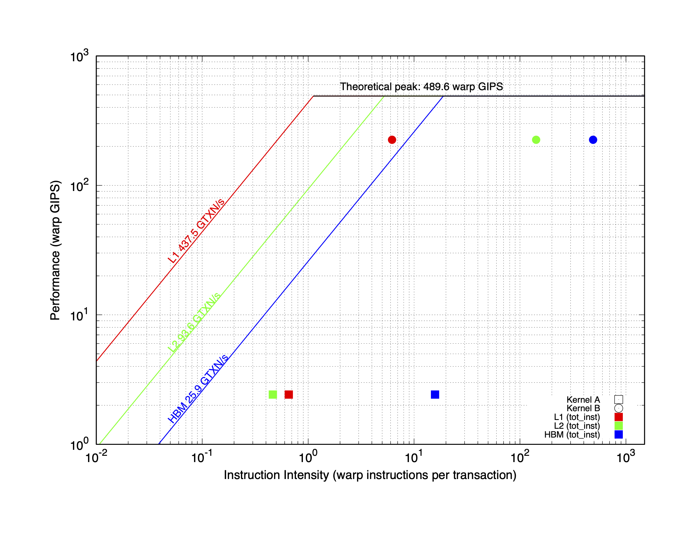
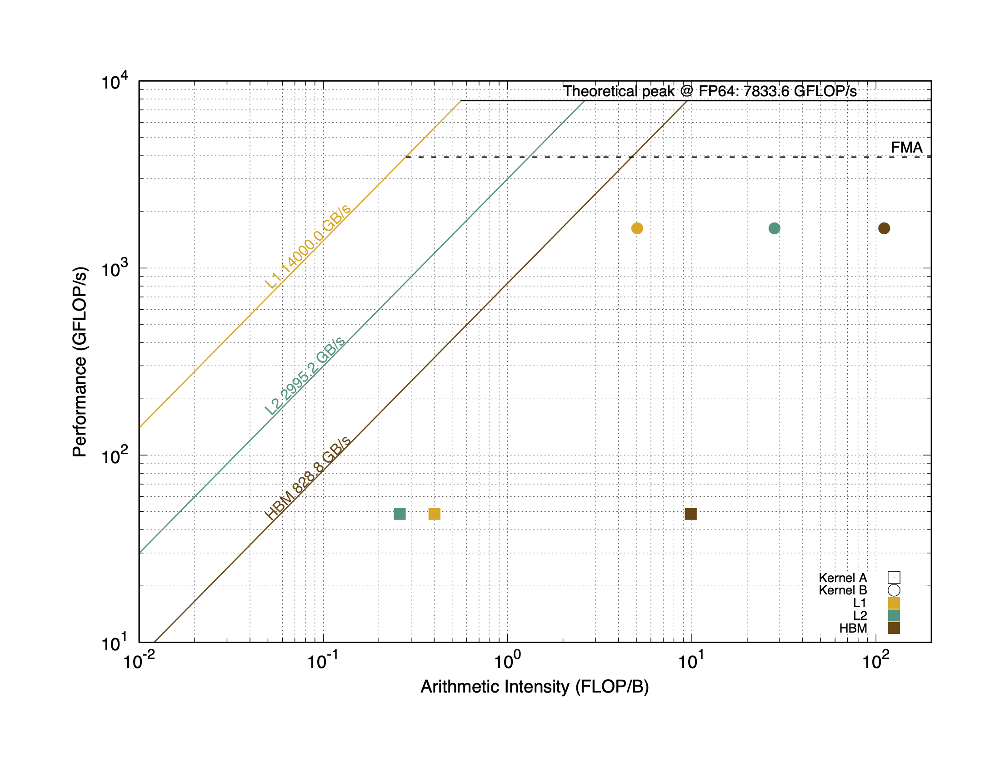
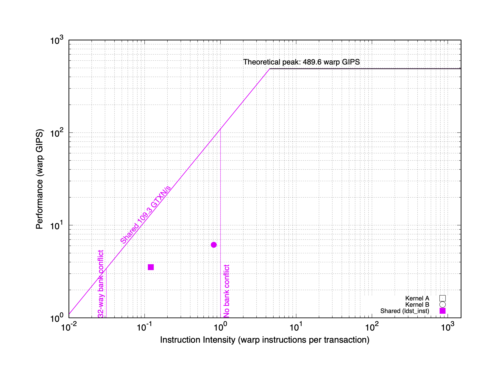
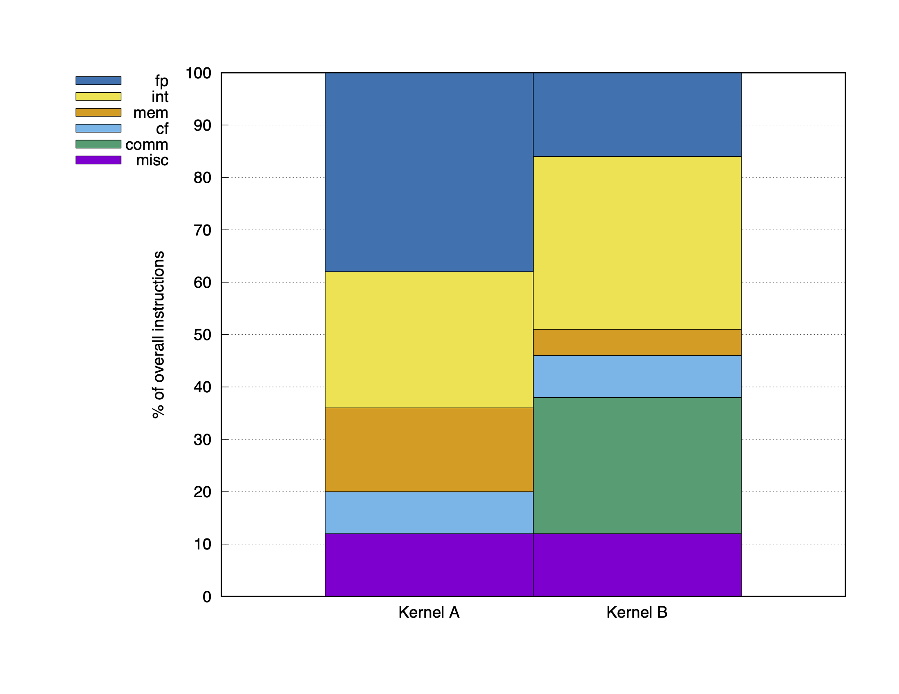
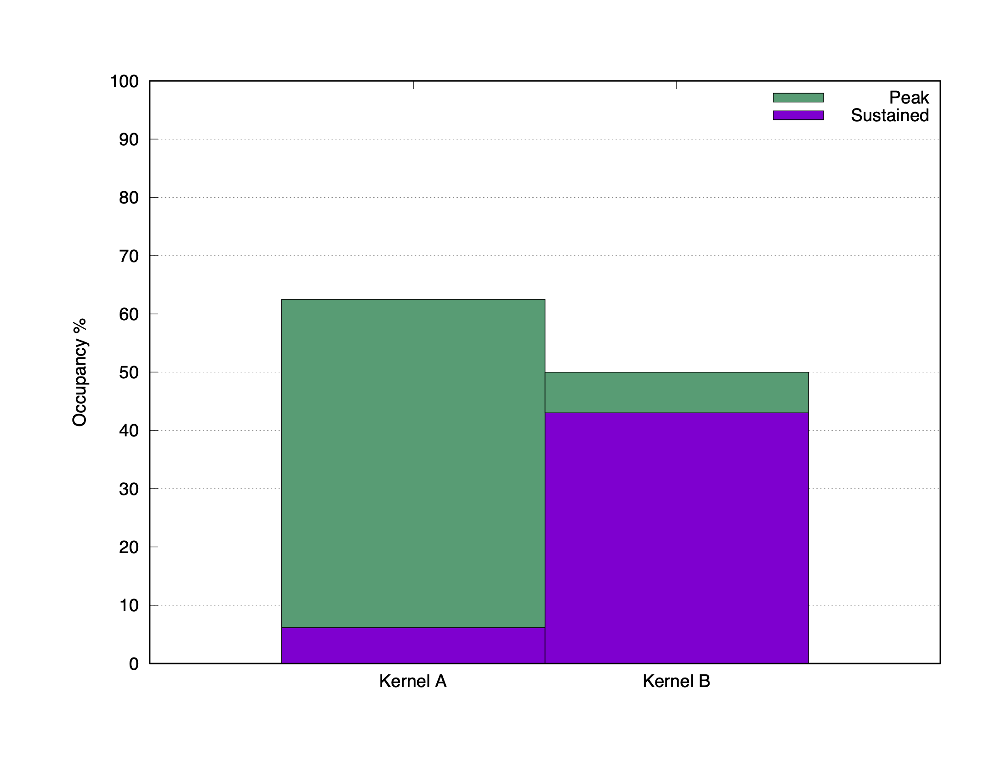

# gpu-charts

Generate unnecessarily fancy profiling plots for CUDA kernels by parsing output from [NVIDIA Nsight compute CLI](https://docs.nvidia.com/nsight-compute/NsightComputeCli/index.html).

> Note: architectural limits are currently specified for NVIDIA V100 GPUs. Automatic parametrization of plots is not currently supported. You can adapt plots to your favorite GPU by editing values labeled as `Device parameters` in `.jinja` files.

## Getting Started

### 1. Collect performance metrics with `ncu`

```
$ ncu $(./ncu-args.sh) myapp.x > myapp.ncu
```

### 2. Generate charts

Make sure the `.ncu` output file is in the root of the repository:

```
$ ls -1 *.ncu
myapp.ncu
```

You can generate a chart for each type by using proper `make` targets:

```
$ make myapp.roofline-fp.pdf
$ make myapp.roofline-inst.pdf
$ make myapp.roofline-shared.pdf
$ make myapp.hist-instmix.pdf
$ make myapp.hist-occupancy.pdf
```

The previous commands generate charts considering *all* kernels in the profiling data.
This can be confusing when the `ncu` output comes from a real-world application with tens of kernels.
To select and plot only specific kernels:

```
$ make ... KERNELS="KernelA KernelB"
```

Only kernels whose declaration contains at least one of the strings in `KERNELS` will be included in plots.

## Available charts

All roofline charts are inspired by:

> N. Ding and S. Williams, “An Instruction Roofline Model for GPUs,” in 2019 IEEE/ACM Performance Modeling, Benchmarking and Simulation of High Performance Computer Systems (PMBS), Denver, CO, USA: IEEE, Nov. 2019, pp. 7–18. doi: 10.1109/PMBS49563.2019.00007.

## 1. Instruction Roofline



## 2. Floating Point Instruction Roofline



## 3. Shared Memory Roofline



## 4. Instruction Mix



## 5. Occupancy


